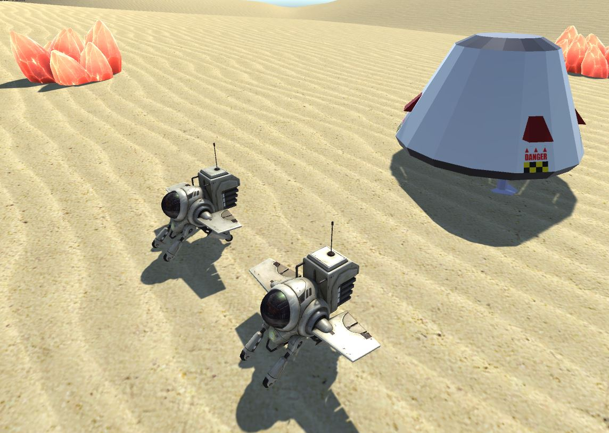

# rtstoy
A toy RTS game. Written in C# for the Unity engine.

# About

This is a game about mining energy crystals, crafting and surviving on an alien planet.

The general story is that your pod has crashlanded onto an alien planet. You must survive by mining the natural resources, and progressively unlocking technologies to enable you to launch back into space.

# Game Design

## PlayerBase

A playerbase is a class that controls units, buildings, tech trees and the current level of achievement. 

## Worker Drone

The player starts with 2 worker drones, and a single Command Hub. Workers can mine energy crystals, and construct new buildings.

## Level of achievement

The player will progress through several 'levels' of achievement, as described by the Techtree. Progressing to the next level of achievement is done by unlocking technologies, building certain number of buildings in the current level and constructing a set number of worker robots. 

Each level of achievement unlocks different buildings, unit types and technologies that aid the player in survival.

The ultimate level being construction of a new space launcher, allowing re-launch into space.

## Tech Tree

The tech tree class is a large map, that describes the necessary improvements that are required to progress to the next level. The tech tree describes requirements for each tech tree improvement.

### Tech Tree Requirements

Each item in the tech tree has requirements. These requirements may take the form of population requirements, resource requirements, research time based requirements, minimum level of achievement requirements etc. Unlocking an item in the tech tree is only possible when the requirements are met.

## Enemies

TBD

## Buildings

### Command Pod

### Research Hub

### Mining Post

### Drone Node
